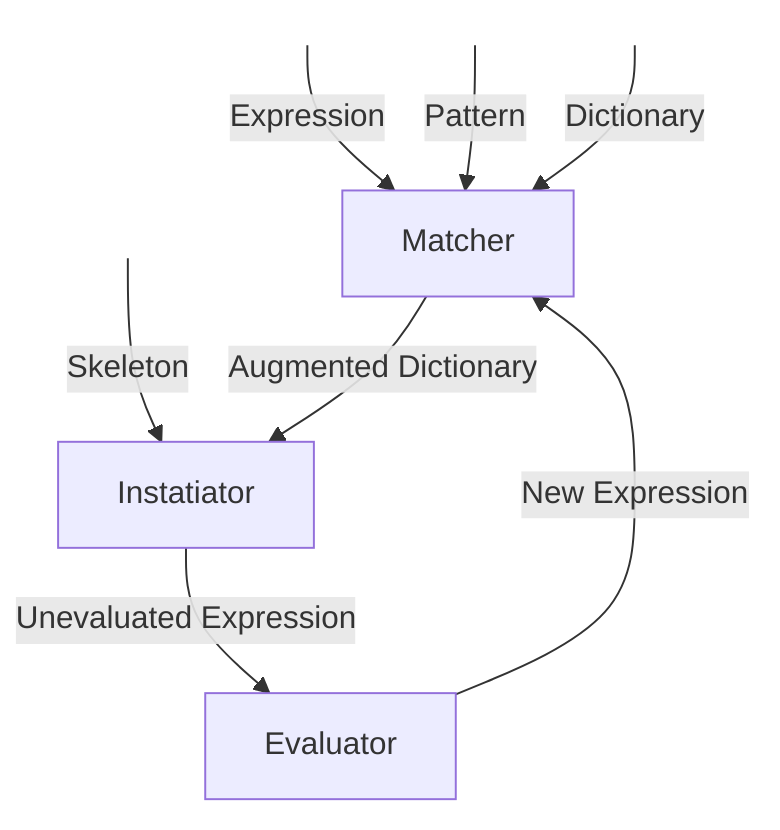
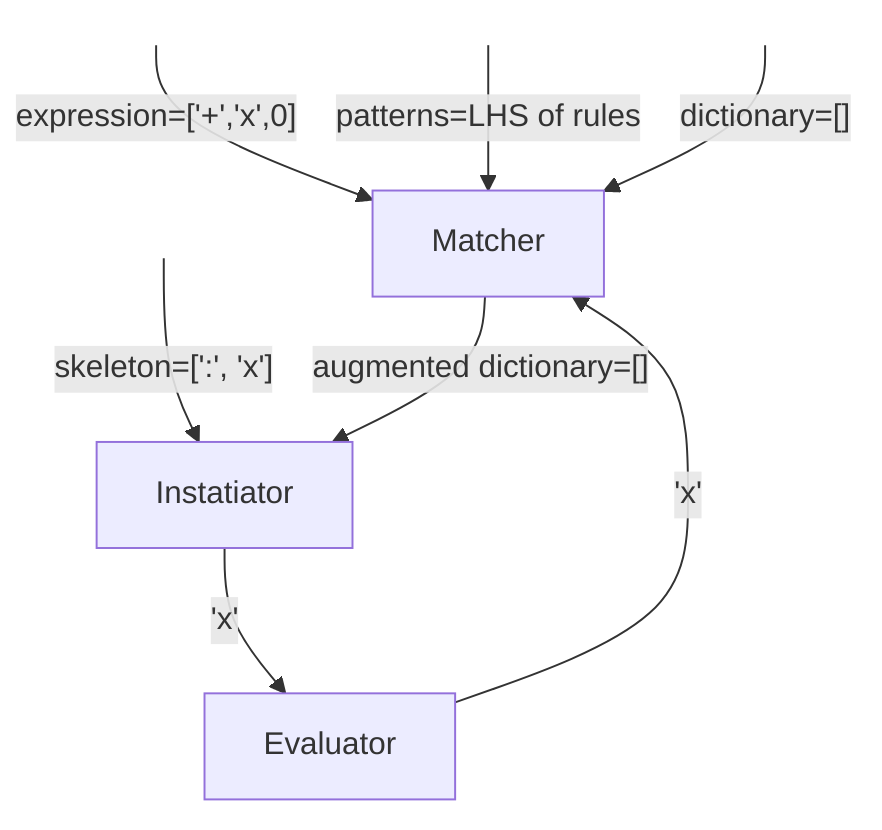
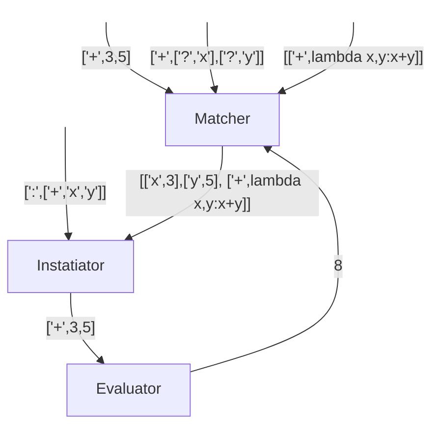

# Expression Toolkit: `xtoolkit`

Rules-based expression rewriting toolkit for symbolic computation.

## Overview

This project is a Python package that provides tools for expression rewriting,
including pattern matching, rule-based transformations (which may sometimes
be considered simplifications, but it depends on the rules), and evaluation of
expressions.

The package includes:

- An expression rewriting engine in `xtoolkit/rewriter.py`, which provides
  functions for matching patterns, instantiating expressions, evaluating forms,
  simplifying expressions using transformation rules, theorem proving using tree search, data generation facilities for AI and machine learning, etc.

- A set of predefined mathematical rules in `xtoolkit/rules/` for algebra,
  calculus, trigonometry, limits, algebraic manipulation of random variables,
  and so on.

- Jupyter notebooks in `notebooks/` that demonstrate some of the functionality
  of the package.

## Installation

To install the package locally, run:

```sh
git clone https://github.com/queelius/xtoolkit
cd xtoolkit
pip install -e .
```

To install it from PyPI, run:

```sh
pip install xtoolkit
```

## The Power of Language Design

In what follows, we show how to represent a rule-based system for symbolic
computation using a simple, yet powerful, domain-specific language. The language
allows us to express transformation rules in a simple, yet powerful, way.

The more general idea of inventing a DSL for a specific domain is powerful.
It allows us to express complex ideas in a concise and readable way. The DSL
can be used to express rules, configurations, generate code, or any other domain-specific information.

Our rules-based system is Turing complete, meaning that it can express any
computable function. This is because the rules is a rewrite system, which is
equivalent to a Turing machine. The rules can be used to express any computable
function, including arithmetic, logic, and even more complex functions. However,
the rule-based system is not a good fit for most general-purpose programming.
It is better suited for symbolic computation, theorem proving, and other
symbolic tasks.

## Representation

The package provides a simple, yet powerful, representation for rules and
expressions.

### Rewrite Rules: Pattern Matching and Skeleton Instantiation

The abstract syntax tree (AST) representation of rewrite rules is a nested list
representation of expressions. The AST representation is used by rewriter
to match patterns against expressions, instantiate skeletons, and evaluate
expressions.

We provide these rewrite rules as a list of lists, where each list contains a
pattern and a skeleton. The pattern is a list that represents the structure of
the expression to match. The skeleton is a template for the replacement
expression.

Here are some examples of AST representations of rewrite rules:

- `[['+', ['?', 'x'], 0], [':', 'x']` represents the rule that the sum of a
  variable `x` and zero is the variable `x`. The pattern is `['+', ['?', 'x'], 0]`
  and the skeleton is `[':', 'x']`.

- `['dd', ['?', 'c'], ['?', 'x'], 0]` represents the rule that the derivative of
  a constant `c` with respect to `x` is zero, $d/dx c = 0$. The pattern is
  `['dd', ['?', 'c'], ['?', 'x']]` and the skeleton is `0`.

#### Simplified DSL

We provide a more consist DSL for writing rules in a more
human-readable format. Here are three example rules in the DSL:

```text
# dc/dx = 0
dd (?c a) (?v x) = 0

# dx/dx = 1
dd (?v x) (?v x) = 1

# d(f*g)/dx = f'g + fg'
dd (* ((? f) (? g)) (?v x))
    =
(+ 
    (* (dd (: f) (: x)) (: g))
    (* (: f) (dd (: g) (: x))
)
```

The LHS of `=` represents the pattern and the RHS represents the skeleton.
`?c a`, `?v x`, and `? f` respectively map to `['?c', 'a']` and `['?v', 'x']`.
In the last rule, we see replacement expressions that use `: f` and `: x` to
refer to the matched expressions in the pattern. We substitute into the
skeleton the matched expressions in the pattern,  e.g., if we have an expression
`(* x (+ y x))`, then `? f` would match `x` and `? g` would match `(+ y x)`.
In the skeleton, `: f` would be replaced by `x` and `: g` would be replaced by
`(+ y x)`. The *instantiated* skeleton is thus
`(+ (* (dd x x) (+ y x)) (* x (dd (+ y x) x)))`.

The DSL is more concise and easier to read than the AST representation, and it
is converted to the AST representation before being used by any of the
algorithms.

You may want to use the AST if you need to programmatically generate or
manipulate rules. The AST is also easier to serialize and deserialize for
storage or transmission.

### Expressions

The Abstract Syntax Tree (AST) represents expressions in the same way that
it represents rules. The AST is a nested list representation of expressions.

- `['+', 'x', 3]` represents the expression \( x + 3 \).
- `['*', ['+', 'x', 3], 4]` represents \( (x + 0) \times 1 \).
- `['dd', ['*', 2, 'x'], 'x']` represents the derivative of \( 2x \) with
  respect to \( x \), $d/dx 2x$. The rewrite rule for this expression is
  `[['dd', ['*', ['?', 'c'], ['?', 'x']], ['?', 'x']], ['*', [':', 'c'], [':', 'x']]]`.


We show a canonical example of a few symbol derivation rules to illustrate the
representation of rules in the package. The rules are represented as a list of
lists, where each list contains a pattern, the left-hand-side (LHS), and a
skeleton, the right-hand-side (RHS). The pattern is a list that represents the
structure of the expression to match. The skeleton is a template for the
replacement expression.

Here are a few simple rules for taking symbolic derivatives:

```python
rules = [
    [['dd', ['?c', 'a'], ['?', 'v']],                   0],
    [['dd', ['?v', 'x'], ['?', 'x']],                   1],
    [['dd', ['?v', 'u'], ['?', 'v']],                   0],
    [['dd', ['+', ['?', 'x1'], ['?', 'x2'], ['?', 'v']],
        ['+', ['dd', [':', 'x1'], [':', 'v']],
              ['dd', [':', 'x2'], [':', 'v']]]           ]
]
```

1. The first rule states that the derivative of a constant is zero. The LHS
pattern is `['dd', ['?c', 'a'], ['?', 'v']]`, where `?c` matches a constant we
name `a` and `?v` matches a variable we name `v`. The RHS skeleton is `0`, which
is the derivative of a constant. The `?` symbol is a **pattern variable** that
matches any expression.

2. The second rule states that the derivative of a variable with respect to
itself is one. The LHS pattern is `['dd', ['?v', 'x'], ['?', 'x']]`, where `?v`
matches a variable we name `x`. The RHS skeleton is `1`, which is the derivative
of a variable with respect to itself.

3. The third rule states that the derivative of a variable with respect to
another variable is zero. The LHS pattern is `['dd', ['?v', 'u'], ['?', 'v']]`,
where `?v` matches a variable we name `u`. The RHS skeleton is `0`, which is the
derivative of a variable with respect to another variable.

4. The fourth rule states that the derivative of a sum is the sum of the
derivatives. The LHS pattern is:

```python
['dd', ['+', ['?', 'x1'], ['?', 'x2'], ['?', 'v']]
```

Here, `?x1` and `?x2` match arbitrary expressions, and `?v` matches a variable.

The RHS skeleton is:

```python
['+', ['dd', [':', 'x1'], [':', 'v']],
      ['dd', [':', 'x2'], [':', 'v']]
]
```

Here, `: x1` and `: x2` refer to the matched arbitrary expressions in the LHS
pattern and are replaced in the RHS skeleton, and `: v` refers to the matched
variable, which is also replaced in the RHS skeleton.

### Alternative JSON Representation

A rule can also be a JSON object, which allows for attaching metadata
to the rule. Here is the same rule as a JSON object:

```json
{
    "pattern": ["dd", ["?c", "a"], ["?v", "x"]],
    "replacement": 0,
    "name": "derivative_of_constant",
    "description": "The derivative of a constant is zero."
}
```

This representation is more verbose than the list representation, but it allows
for attaching metadata to the rule, such as a name and a description. The JSON
representation is useful when you need to attach metadata to the rule, such as
for annotating the rule with a name and a description for generating
machine learning training data.

## Pattern Matching

The package provides a pattern-matching engine that can match patterns against
expressions. The pattern-matching engine is used to match the LHS of a rule
against an expression to determine if the rule can be applied.

In what follows, we describe the pattern-matching syntax:

- An expression `foo` matches exactly `foo`.
- An expression `["f", "a", "b"]` matches a list whose first element is `"f"`
  and whose second and third elements are `"a"` and `"b"`, respectively.
- An expression `["?", "x"]` matches any expression and binds it to the variable
  `x`.
- An expression `['?c', 'a']` matches any constant and binds it to the variable
  `a`.
- An expression `['?v', 'x']` matches any variable and binds it to the variable
  `x`.

  This may seem rather simple, but it is quite powerful.

## Skeleton Instantiation

The package provides a skeleton instantiation engine that can instantiate a
skeleton using a dictionary of bindings. The skeleton instantiation engine is
used to generate the RHS of a rule by replacing the pattern variables with the
matched expressions.

In what follows, we describe the skeleton instantiation syntax:

- The skeleton `foo` instantiates to `foo`.
- The skeleton `["f", "a", "b"]` instantiates to a list whose first element is
  `"f"` and whose second and third elements are `"a"` and `"b"`, respectively.
- The skeleton `[":", "x"]` instantiates to the expression bound to the variable
  `x`. It *evaluates* the variable `x` and substitutes the result into the
  skelton. For instance '[":", 'x']' would instantiate to the value of the
  variable `x` in the dictionary of bindings. Let's show a more complex example
  to illustrate the finer points of skeleton instantiation. Consider the rule:
  
  ```python
  [[['?', 'op'] ['?c', 'x1'], ['?c', 'x2']],
   [[':', 'op'], [':', 'x1'], [':', 'x2']]]
  ```

## Evaluation

The package provides an evaluator that can evaluate instantiated skeleton
expressions using a dictionary of values and operations. The evaluator is used
to evaluate the RHS of a rule to obtain the result of applying the rule.

For example, `[':', 'x']` would evaluate to the value of the variable `x` in the
dictionary of bindings. The evaluator can also evaluate expressions that contain
operations. For example, if `+` is  primitive in the dictionary of bindings,
say `dict = [['+', lambda x, y: x + y]]`, then `['+', 3, 4]` would evaluate to
`7`.

You may also call the evaluator directly to evaluate an expression. For example,
if you have a dictionary of bindings `dict = [['+', lambda x, y: x + y]]`, you
can evaluate the expression `['+', 3, 4]` by calling `evaluate(['+', 3, 4], dict)`.
The dict is like an *environment* that provides the values of variables and the
operations that can be applied to them. If `+` was not defined in the dictionary,
then the evaluator would raise an exception since it would be an undefined
operation. A dictionary of bindings is thus a **closure** that gives meaning to
the expressions.

### Example: Evaluating Expressions

The `evaluate` function can evaluate expressions given a dictionary of values
and operations. We show an example of evaluating an expression:

```python
from xtoolkit import evaluate

# Define the dictionary
the_dict = [
    ['+', lambda x, y: x + y],
    ['x', 3],
    ['y', 4]
]

# Evaluate the expression
form = ['+', 'x', 'y']
result = evaluate(form, the_dict)
print(f"evaluate({form}, {dict1}) => {result}")
# Output: evaluate(['+', 'x', 'y'], [['+', <function <lambda>...>], ['x', 3], ['y', 4]]) => 7
```

We provide a deeper look at `evaluate` later.

## Simplification: Rewriting Rules Recursively Applied to Expressions Bottom-Up

Simplification is a slippery concept. What is simple to one person may be 
complex to another. However, in the context of symbolic computation, we can
define simplification as the process of rewriting an expression according to
a set of transformation rules. The goal is to transform the expression into
a simpler **self-evaluating** form, where simplicity is defined implicitly by
the rules.

We define a **self-evaluating** form as an expression that does not match any
pattern in the rules or, if it does, the instantiated skeleton evaluates to
the same expression.

We define a **rule** as a pair of a pattern and a skeleton. The pattern is a
list that represents the structure of the expression to match. The skeleton is
a template for the replacement expression. The rule is applied by matching the
pattern against the expression, instantiating the skeleton using the bindings
from the match, and replacing the matched sub-expression with the result.

## The Simplification Process

We may represent the simplification process pictorially as follows:



The `Matcher` matches the `Expression` against the `Pattern`. It outputs an
`Augmented Dictionary` that adds the bindings from the match. The `Instantiator`
instantiates the skeleton using the augmented dictionary. This creates a new
expression. However, the expression may sometimes be further reduced by the
`Evaluator`, e.g., the skelton `[":", 'x']` would evaluate to the value of the
variable `x` in the augmented dictionary. If the augmented dictionary has the
entry `[x, 3]`, then the skeleton `[":", 'x']` would evaluate to `3` and in the
evaluation step, `3` $\mapsto 3$ since it is self-evaluating. However, if the
skeleton is `[":", ['+', 'x', 5]]`, then the instantiated skeleton would be
`['+', 3, 5]`. There may not be a simple rule like `[+, 3, 5] = 8` to simplify
this further. However, if the dictionary contains `[+, lambda x, y: x + y]`,
then the evaluator would evaluate the expression `['+', 3, 5]` to `8`.

In what follows, we show two concrete instances of the above figure.

### Example 1

In the first example, we have an expression `['+','x',0]` and a single rule
given by:

```python
[
  [['+', ['?', 'x'], [ '?c', 0]], [':', 'x']]
]
```

Here is what the above figure looks like for this example:



In the above figure, the `Matcher` matches the expression `['+', 'x', 0]` against the pattern `['+', ['?', 'x'], ['?c', 0]]`. The augmented dictionary is the same as the initial empty dictionary, `[]`. The `Instantiator` instantiates the skeleton `[':', 'x']` to `'x'`. The `Evaluator` evaluates the expression `'x'` to `'x'`. The new expression is `'x'`. Since `'x'` is self-evaluating, the process stops.

### Example 2

Next, we consider an example where the evaluator applies an additional
transformation. We have an expression `['+', 3, 5]` and a single rule given by:

```python
[
  [['+', ['?', 'x'], ['?', 'y']], ['+', [':', 'x'], [':', 'y']]]
]
```



In the above figure, the `Matcher` matches the expression `['+', 3, 5]` against
the pattern `['+', ['?', 'x'], ['?', 'y']]`. The augmented dictionary is
`[['x', 3], ['y', 5], ['+', lambda x, y: x + y]]`. The `Instantiator`
instantiates the skeleton `['+', 'x', 'y']` to `['+', 3, 5]`. The `Evaluator`
evaluates the expression `['+', 3, 5]` to `8`. The new expression is `8`.
Since `8` is self-evaluating, the process stops (unless the matcher has
a rule like `[8, 9]`, in which case '8' is not self-evaluating).

#### Additional Note on Example 2

Note that if the dictionary did not contain the operation `+`, then the
evaluator would pass the expression `['+', 3, 5]` unchanged. The process
would then stop since the process did not *change* the expression, which is
the termination condition for the simplification process (no rule changed
the expression). This is in contrast to typical programming languages where
the process raises an exception if an operation is not defined. In this
symbolic rewriting system, the process always yields an expression if the
expression is well-formed and the rules are well-defined, i.e., do not
lead to an infinite rewriting loop. Any Turing-complete system is
susceptible to infinite loops, so this is no surprise.

### Complex Expressions

In the above examples, for simplicity, we used simple expressions that only
required a single rule to simplify. However, in general, an expression may
contained nested expressions that require multiple rules to simplify. The
simplification process is recursive, and it applies the rules bottom-up, i.e.,
it finds the leaf nodes of the expression tree and applies the rules to them
first before moving up the tree. The process continues until no rule is found
that changes the expression. The process is guaranteed to terminate if the
rules are well-defined and do not lead to an infinite rewriting loop.

### Implementing Simplification

We define a `simplifier` funcgtion in the `simplifier.py` module that takes a
list of rules and returns a function that simplifies expressions using the
rules. The simplifier function is recursive, and it applies the rules bottom-up,
i.e., it finds the leaf nodes of the expression tree and applies the rules to
them first before moving up the tree. The process continues until no rule is
found that changes the expression.

For the returned `simplifier` function to be guaranteed to terminate, the rules
must be written in a way that does not lead to an infinite rewriting loop.
This may be easier said than done, but it is a necessary condition for the
simplification process to work correctly.

#### Example: Simplifying Derivatives

Consider the rule for the derivative of a constant, $d/dx c = 0$ where $c$ is
a constant with respect to $x$. This rule can be represented as:

```python
[['dd', ['?c', 'c'], ['?v', 'v']], 0]
```

Using this rule, we can simplify the derivative of a constant expression:

```python
from exprtoolkit.rewriter import simplifier

# Define the rule
rules = [
    [['dd', ['?c', 'c'], ['?v', 'v']], 0]
]

# Create the simplifier function
simplify = simplifier(rules)

# Simplify the expression
expr = ['dd', 3, 'x']
result = simplify(expr)
print(f"{expr} =>, {result}")
# Output: ['dd', 3, 'x'] => 0
```

Note that `['dd, ['?c', 'a'], ['?v', 'x']]` is a pattern that matches the
derivative of a constant `a` with respect to variable `x`,

$$
dc/dv = 0
$$

where `?c` and `?v` respectively match constants and variables.
Additionally, `?` matfches any expression. Thus, `[?c, 'a']` matches arbitrary
constants, which we name `a`, `[?v, 'x']` matches arbitrary variables, which we
name `x`, and `[? , 'e']` matches any expression that we name `e`.

## Tree Search as Theorem Proving

Sometimes, your goal is not some notion of **simplification** but rather to
explore the space of expressions, often to show some equivalence between
two expressions. This may be thought of as a theoem-proving task. The package
provides various tree search algorithms that can be used to explore the space
of expressions.

The tree search algorithms are used to explore the space of
expressions to find an expression that matches a set of target expressions.
The set of target expressios are defined by a set of patterns or more generally
by some predicate that defines conditions that the target expressions must 
satisfy.

We consider multiple tree search algorithms:

- **Breadth-first search (BFS)**

  This is an uninformed search algorithm that explores the space of expressions
  in a breadth-first manner. It is guaranteed to find the fewest number of
  rewrites that lead to a target expression, but it may be quite slow and
  memory intensive for deep search trees.

- **Depth-first search (DFS)**

  This is an uninformed search algorithm that explores the space of expressions
  in a depth-first manner. It is not guaranteed to find the fewest number of
  rewrites that lead to a target expression, but it may be more memory efficient
  than BFS for deep search trees.

- **Iterative deepening depth-first search (IDDFS)**

  This is a variant of DFS that combines the memory efficiency of DFS with the
  completeness of BFS. It is guaranteed to find the fewest number of rewrites
  that lead to a target expression.

- **Best-first search**

  This is an informed search algorigthm. It requires a heuristic function that
  estimates the distance to the set of target expressions. It is not guaranteed
  to find the simplest set of rewrites that lead to a target expression, however
  that is defined implicitly by the heuristic function, but it can more
  efficiently explore the space of expressions than uninformed search algorithms
  like BFS and DFS, avoiding branches that are more distant from the target
  expressions.

- **$A^*$ search**

  This is an informed search algorithm that uses a heuristic function to estimate
  the distance to the set of target expressions. If the heuristic function is
  admissible, then $A^*$ search is guaranteed to find the simplest set of
  rewrites that lead to a target expression, where simplicity is defined by the
  heuristic function. If the heuristic function is inadmissible, then $A^*$
  search is not guaranteed to find the simplest set of rewrites, but it can
  more efficiently explore the space of expressions than uninformed search
  algorithms like BFS and DFS.

- **Monte Carlo Tree Search (MCTS)**

  This algorithm does not require a heuristic function to estimate the simplest
  set of rewrites that lead to a target expression. It uses random sampling to
  explore the space of expressions. However, without a heuristic to guide the
  search, MCTS may be quite slow, just like uninformed search algorithms like
  DFS. For instance, it is guaranteed to be **slower** than DFS, since MCTS
  is essentially a DFS process for unexplorable non-terminal states, but
  it will generally be more efficient at finding a good solution than DFS
  and BFS for deep search trees.

## Modules

The package is organized into the following modules.

### Matcher, Instantiator, Evaluator: `rewriter.py`

This module contains the functions:

- `match(pat, exp, dict)`

: Matches a pattern `pat` against an expression `exp` using a dictionary `dict`.

- `instantiate(skeleton, dict)`

: Instantiates a `skeleton` expression using the dictionary `dict`.

- `evaluate(form, dict)`

: Evaluates an expression `form` using the dictionary `dict`.

### Simplifier: `simplifier.py`

- `simplifier(the_rules)`

: Returns a function to simplify expressions using `the_rules`

### Theorem Proving

- `bfs(rules: List, targets: Union[List,CAllable])`

: Breadth-first search

- `dfs(rules: List, targets: Union[List,CAllable])`

: Depth-first search

- `iddfs(rules: List, targets: Union[List,CAllable])`

: Iterative deepening depth-first search

- `best_first(rules: List, targets: Union[List,CAllable], heuristic: Callable)`

: Best-first search

- `astar(rules: List, targets: Union[List,CAllable], heuristic: Callable)`

: A* search

- `mcts(rules: List, targets: Union[List,CAllable])`

: Monte Carlo Tree Search

Each of these functions takes a list of rules and a set of target expressions
(or a predicate that defines the conditions that the target expressions must
satisfy) and returns a function that explores the space of expressions to find
an expression that matches the target expressions.

Each search algorithm is located in its own module:

- `search/bfs.py`, the breadth-first search algorithm,
- `search/dfs.py`, the depth-first search algorithm,
- `search/iddfs.py`, the iterative deepening depth-first search algorithm,
- `search/best_first.py`, the best-first search algorithm,
- `search/astar.py`, the A* search algorithm,
- `search/mcts.py`. the Monte Carlo Tree Search algorithm.

### Pre-defined Rewrite Rules

In the `rules` directory, we provide a set of predefined rules for various
rewriting tasks. Here is a list of these pre-defined rules:

- `deriv-rules.py` have rules for symbolically taking derivatives.
- `trig-rules.py` have rules for trigonometric functions.
- `limit-rules.py` have rules for limits.
- `random-var-rules.py` have rules for algebraic manipulation of random variables.
- `integral-rules.py` have rules for integrals.
- `calculus-rules.py` have rules for calculus.
- `algebra-rules.py` have rules for algebraic manipulation.
- `numberical-procedures.py` have procedures for numerical computation, which
  are not rules but functions that the `evaluate` function can use to further
  simplify or reduce expressions.
- `diff-eq-rules.py` have rules for solving differential equations.
- `first-order-logic-rules.py` have rules for classical first-order logic.
- `set-theory-rules.py` have rules for set theory.
- `boolean-algebra-rules.py` have rules for boolean algebra.
- `combinatorics-rules.py` have rules for combinatorics.
- `graph-theory-rules.py` have rules for graph theory.
- `group-theory-rules.py` have rules for group theory.
- `ring-theory-rules.py` have rules for ring theory.
- `field-theory-rules.py` have rules for field theory.
- `vector-space-rules.py` have rules for vector spaces.
- `linear-algebra-rules.py` have rules for linear algebra.
- `topology-rules.py` have rules for topology.
- `measure-theory-rules.py` have rules for measure theory.
- `probability-theory-rules.py` have rules for probability theory.
- `statistics-rules.py` have rules for statistics.

## Notebooks and Examples

The `notebooks` directory contains Jupyter notebooks that demonstrate the
functionality of the package.
