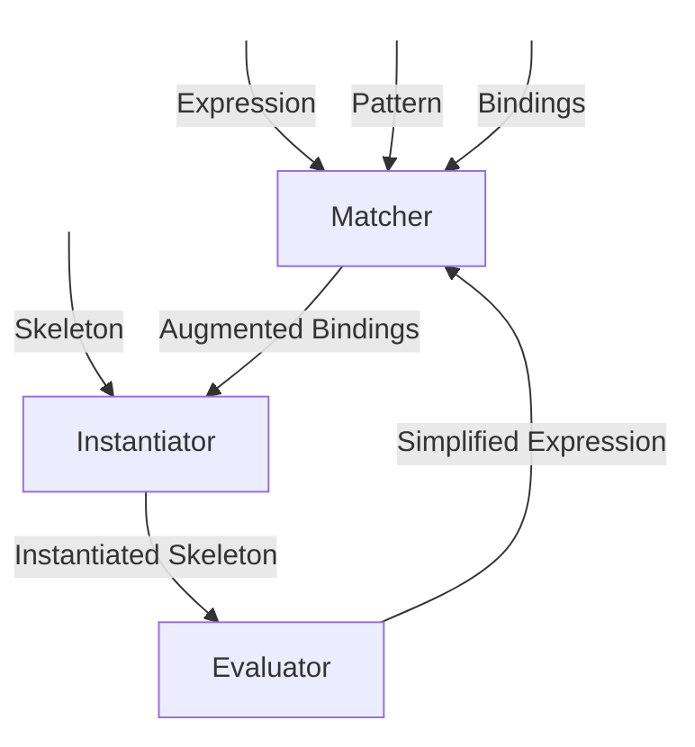

# XTK - Expression Toolkit

[](https://github.com/queelius/xtk/actions/workflows/ci.yml)
[](https://badge.fury.io/py/xpression-tk)
[](https://www.python.org/downloads/)
[](https://opensource.org/licenses/MIT)

A powerful symbolic expression toolkit for rule-based term rewriting in Python. XTK provides pattern matching, expression transformation, and symbolic computation capabilities with an **interactive REPL featuring rich visualizations**, support for multiple input formats including S-expressions and infix notation, and step-by-step transformation tracing.

## Introduction

`xtk` is a Python package that provides tools for symbolic computation through expression rewriting. It offers capabilities such as pattern matching, rule-based transformations, expression evaluation, theorem proving via tree search, and data generation for AI and machine learning applications.

## Quick Start

### Interactive REPL (Recommended)

The fastest way to explore XTK is through the interactive REPL:

```bash
pip install xpression-tk
python3 -m xtk.cli
```

Try these commands:
```
xtk> (+ 2 3)        # Arithmetic evaluation
xtk> /rewrite
Rewritten: 5

xtk> /tree          # Tree visualization
xtk> /rules load src/xtk/rules/deriv_rules.py
xtk> (dd (^ x 2) x) # Differentiation
xtk> /rw
xtk> /help
```

See [REPL_GUIDE.md](REPL_GUIDE.md) for complete documentation.

### Programmatic Usage

Here's a simple example of how to use `xtk` to rewrite an expression:

   ```python
   from xtk import rewriter

   # Define a rewrite rule: x + 0 => x
   rules = [
       [['+', ['?', 'x'], 0], [':', 'x']]
   ]

   # Create a rewriter function using the rule
   rewrite = rewriter(rules)

   # Rewrite an expression
   expr = ['+', 'a', 0]
   result = rewrite(expr)
   print(f"Rewritten expression: {result}")  # Output: Rewritten expression: a
   ```

3. **Exploring More Features**:

   To explore more advanced features like symbolic differentiation, tree search algorithms for theorem proving, and working with predefined mathematical rules, refer to the detailed sections below.

## Table of Contents

- [Expression Toolkit: `xtk`](#expression-toolkit-xtk)
  - [Introduction](#introduction)
  - [Quick Start](#quick-start)
  - [Table of Contents](#table-of-contents)
  - [Installation](#installation)
  - [Overview](#overview)
  - [Representation of Rules and Expressions](#representation-of-rules-and-expressions)
    - [Rewrite Rules: Pattern Matching and Skeleton Instantiation](#rewrite-rules-pattern-matching-and-skeleton-instantiation)
      - [Abstract Syntax Tree (AST) Representation](#abstract-syntax-tree-ast-representation)
        - [Examples](#examples)
      - [Simplified Domain-Specific Language (DSL)](#simplified-domain-specific-language-dsl)
      - [Alternative JSON Representation](#alternative-json-representation)
    - [Expressions](#expressions)
  - [Pattern Matching](#pattern-matching)
  - [Skeleton Instantiation](#skeleton-instantiation)
  - [Evaluation](#evaluation)
    - [Example: Evaluating Expressions](#example-evaluating-expressions)
  - [Simplification Process](#simplification-process)
    - [The Simplification Process](#the-simplification-process)
    - [Example: Simplifying Expressions](#example-simplifying-expressions)
      - [Steps:](#steps)
      - [Example with Evaluation](#example-with-evaluation)
  - [Tree Search and Theorem Proving](#tree-search-and-theorem-proving)
    - [Search Algorithms](#search-algorithms)
  - [Modules](#modules)
    - [Core Modules](#core-modules)
    - [Search Modules](#search-modules)
  - [Using Tree Search Algorithms: DFS and Best-First Search](#using-tree-search-algorithms-dfs-and-best-first-search)
    - [Depth-First Search (DFS)](#depth-first-search-dfs)
      - [Example: Proving a Trigonometric Identity](#example-proving-a-trigonometric-identity)
        - [Steps:](#steps-1)
      - [Explanation](#explanation)
    - [Best-First Search](#best-first-search)
      - [Example: Simplifying an Algebraic Expression](#example-simplifying-an-algebraic-expression)
        - [Proofs Steps](#proofs-steps)
      - [Explanation of Best-First Search](#explanation-of-best-first-search)
    - [Notes on Usage](#notes-on-usage)
    - [Additional Tips](#additional-tips)
    - [Practical Applications](#practical-applications)
  - [Predefined Rewrite Rules](#predefined-rewrite-rules)
  - [Notebooks and Examples](#notebooks-and-examples)
  - [The Power of Language Design](#the-power-of-language-design)

## Installation

To install the package locally from the source code:

```sh
git clone https://github.com/queelius/xtk
cd xtk
pip install -e .
```

To install it from PyPI:

```sh
pip install xtk
```

## Overview

`xtk` provides a comprehensive set of tools for symbolic computation:

- **Expression Rewriting Engine** (`xtk/rewriter.py`): Functions for pattern matching, expression instantiation, evaluation, and simplification using transformation rules.

- **Simplifier** (`xtk/simplifier.py`): A recursive simplifier that applies rewrite rules to expressions in a bottom-up manner, facilitating expression simplification.

- **Tree Search Algorithms** (`xtk/search/`): Algorithms for theorem proving and exploring expression spaces, including BFS, DFS, IDDFS, Best-First Search, A\* Search, and Monte Carlo Tree Search.

- **Predefined Mathematical Rules** (`xtk/rules/`): A collection of rules for various mathematical domains such as algebra, calculus, trigonometry, limits, and more.

- **Jupyter Notebooks** (`notebooks/`): Examples demonstrating the functionality of the package.

## Representation of Rules and Expressions

`xtk` employs a powerful yet simple representation for rules and expressions, enabling efficient definition and manipulation of symbolic expressions.

### Rewrite Rules: Pattern Matching and Skeleton Instantiation

#### Abstract Syntax Tree (AST) Representation

Rewrite rules are defined using an abstract syntax tree (AST) representation, utilizing nested lists to represent expressions. Each rule consists of:

- **Pattern**: Defines the structure of the expression to match.
- **Skeleton**: A template for the replacement expression.

##### Examples

1. **Simplification Rule**: The sum of a variable `x` and zero simplifies to `x`.

   ```python
   [['+', ['?', 'x'], 0], [':', 'x']]
   ```

   - **Pattern**: `['+', ['?', 'x'], 0]`
   - **Skeleton**: `[':', 'x']`

2. **Derivative of a Constant**: The derivative of a constant `c` with respect to `x` is zero, \( \frac{d}{dx} c = 0 \).

   ```python
   [['dd', ['?c', 'c'], ['?', 'x']], 0]
   ```

   - **Pattern**: `['dd', ['?c', 'c'], ['?', 'x']]`
   - **Skeleton**: `0`

#### Simplified Domain-Specific Language (DSL)

For enhanced readability, `xtk` offers a simplified DSL for writing rules:

```text
# Derivative of a constant: d(c)/dx = 0
dd (?c c) (?v x) = 0

# Derivative of a variable with respect to itself: d(x)/dx = 1
dd (?v x) (?v x) = 1

# Product rule: d(f * g)/dx = f' * g + f * g'
dd (* (? f) (? g)) (?v x) =
    (+ (* (dd (: f) (: x)) (: g))
       (* (: f) (dd (: g) (: x))))
```

In the DSL:

- `?c c`: Matches any constant and binds it to `c`.
- `?v x`: Matches any variable and binds it to `x`.
- `? f`, `? g`: Match any expressions and bind them to `f` and `g`.
- `:` is used in the skeleton to refer to matched variables from the pattern.

#### Alternative JSON Representation

Rules can also be represented as JSON objects, allowing for additional metadata:

```json
{
  "pattern": ["dd", ["?c", "c"], ["?v", "x"]],
  "replacement": 0,
  "name": "derivative_of_constant",
  "description": "The derivative of a constant is zero."
}
```

### Expressions

Expressions are represented in the same AST format as rules:

- `['+', 'x', 3]` represents \( x + 3 \).
- `['*', ['+', 'x', 3], 4]` represents \( (x + 3) \times 4 \).
- `['dd', ['*', 2, 'x'], 'x']` represents \( \frac{d}{dx} (2x) \).

## Pattern Matching

Pattern matching is used to determine if a rule can be applied to an expression. The syntax includes:

- **Exact Match**: An expression `foo` matches exactly `foo`.
- **List Match**: An expression `["f", "a", "b"]` matches a list with first element `"f"` and subsequent elements `"a"`, `"b"`.
- **Pattern Variables**:
  - `['?', 'x']`: Matches any expression and binds it to `x`.
  - `['?c', 'c']`: Matches any constant and binds it to `c`.
  - `['?v', 'x']`: Matches any variable and binds it to `x`.

This pattern-matching system is simple yet powerful, allowing for flexible expression transformations.

## Skeleton Instantiation

After matching, the skeleton is instantiated by replacing pattern variables with the matched expressions:

- **Direct Substitution**: `["f", "a", "b"]` remains unchanged.
- **Variable Substitution**: `[':', 'x']` is replaced with the expression bound to `x`.

For example, if `x` is bound to `3`, then `[':', 'x']` instantiates to `3`.

## Evaluation

The evaluator computes the value of instantiated skeleton expressions using a dictionary of bindings for operations and variables.

### Example: Evaluating Expressions

```python
from xtk import evaluate

# Define the bindings
bindings = {
    '+': lambda x, y: x + y,
    'x': 3,
    'y': 4
}

# Evaluate the expression
expr = ['+', 'x', 'y']
result = evaluate(expr, bindings)
print(f"evaluate({expr}, {bindings}) => {result}")
# Output: evaluate(['+', 'x', 'y'], {'+': <function>, 'x': 3, 'y': 4}) => 7
```

In this example:

- The evaluator replaces `'x'` and `'y'` with their values `3` and `4`.
- It then applies the `+` operation to compute `7`.

## Simplification Process

Simplification involves recursively applying rewrite rules to an expression until it cannot be further reduced. The process works bottom-up, simplifying sub-expressions before moving up the expression tree.

### The Simplification Process

We can visualize the simplification process as follows:



1. **Matcher**: Matches the pattern against the expression and generates bindings.
2. **Instantiator**: Uses the bindings to instantiate the skeleton.
3. **Evaluator**: Evaluates the instantiated skeleton to produce a simplified expression.
4. **Recursive Application**: The process repeats until no further simplifications can be made.

### Example: Simplifying Expressions

**Simplify** `['+', 'x', 0]` using the rule that adding zero simplifies to the original expression.

- **Rule**: `[['+', ['?', 'x'], 0], [':', 'x']]`

#### Steps:

1. **Match**:

   - Pattern: `['+', ['?', 'x'], 0]`
   - Expression: `['+', 'x', 0]`
   - Binding: `{'x': 'x'}`

2. **Instantiate**:

   - Skeleton: `[':', 'x']`
   - Instantiated Skeleton: `'x'`

3. **Evaluate**:

   - Result: `'x'`

The expression simplifies from `['+', 'x', 0]` to `'x'`.

#### Example with Evaluation

Simplify `['+', 3, 5]` using the addition operation defined in the evaluator.

- **Bindings**: `{'x': 3, 'y': 5, '+': lambda x, y: x + y}`

- **Expression**: `['+', 'x', 'y']`

- **Evaluate**:

  - Replace `'x'` and `'y'` with `3` and `5`.
  - Apply `+` operation: `3 + 5 = 8`.

- **Result**: `8`

## Tree Search and Theorem Proving

Beyond simplification, `xtk` provides tree search algorithms for tasks such as theorem proving, where the goal is to find a sequence of rewrites that transforms an expression into a target form.

### Search Algorithms

- **Breadth-First Search (BFS)**: Explores all nodes at the current depth before moving deeper.
- **Depth-First Search (DFS)**: Explores as far as possible along each branch before backtracking.
- **Iterative Deepening DFS (IDDFS)**: Combines DFS's space efficiency with BFS's completeness.
- **Best-First Search**: Uses a heuristic to explore more promising branches first.
- **A\* Search**: Combines path cost and heuristic information for optimal pathfinding.
- **Monte Carlo Tree Search (MCTS)**: Uses randomness and statistical sampling to explore the search space.

These algorithms can be used to prove equivalence between expressions, find transformations that satisfy certain conditions, or explore the space of possible rewrites.

## Modules

### Core Modules

- **`rewriter.py`**: Contains core functions for pattern matching, instantiation, and evaluation.

  - `match(pattern, expression, bindings)`: Matches a pattern against an expression using the provided bindings.
  - `instantiate(skeleton, bindings)`: Instantiates a skeleton using the bindings.
  - `evaluate(expression, bindings)`: Evaluates an expression using the bindings.

- **`simplifier.py`**:

  - `simplifier(rules)`: Returns a function to simplify expressions using the provided rules.

### Search Modules

Each search algorithm is implemented in its own module under `search/`:

- **`bfs.py`**: Breadth-First Search
- **`dfs.py`**: Depth-First Search
- **`iddfs.py`**: Iterative Deepening DFS
- **`best_first.py`**: Best-First Search
- **`astar.py`**: A\* Search
- **`mcts.py`**: Monte Carlo Tree Search

These modules provide functions to perform search operations on expression spaces. Next, we show how to use these modules to explore the space of possible rewrites.

## Using Tree Search Algorithms: DFS and Best-First Search

`xtk` provides powerful tree search algorithms for tasks such as theorem proving, expression transformation, and exploring possible rewrites. This section demonstrates how to use Depth-First Search (DFS) and Best-First Search within `xtk`.

### Depth-First Search (DFS)

DFS explores as far as possible along each branch before backtracking, making it suitable for finding deep solutions without excessive memory consumption.

#### Example: Proving a Trigonometric Identity

**Goal**: Prove the identity \( \sin^2 x + \cos^2 x = 1 \) by transforming the left-hand side (LHS) into the right-hand side (RHS) using DFS.

##### Steps:

1. **Define the Rewrite Rules**

   We'll use fundamental trigonometric identities as rewrite rules.

   ```python
   # trigonometric_rules.py
   rules = [
       # Pythagorean identity
       [['+', ['^', ['sin', ['?','x']], 2], ['^', ['cos', ['?','x']], 2]], 1],
       # Expand sine squared
       [['^', ['sin', ['?','x']], 2], ['-', 1, ['^', ['cos', [':','x']], 2]]],
       # Expand cosine squared
       [['^', ['cos', ['?','x']], 2], ['-', 1, ['^', ['sin', [':','x']], 2]]],
       # Sine double angle
       [['sin', ['*', 2, ['?','x']]], ['*', 2, ['sin', [':','x']], ['cos', [':','x']]]],
       # Cosine double angle
       [['cos', ['*', 2, ['?','x']]], ['-', ['^', ['cos', [':','x']], 2], ['^', ['sin', [':','x']], 2]]],
       # Other relevant identities...
   ]
   ```

2. **Set Up the Initial Expression and Goal Test**

   ```python
   initial_expr = ['+', ['^', ['sin', 'x'], 2], ['^', ['cos', 'x'], 2]]

   # Define a goal test function
   def goal_test(expr):
       return expr == 1
   ```

3. **Implement DFS**

   ```python
   from xtk.search.dfs import dfs_search

   # Perform the search
   solution = dfs_search(initial_expr, rules, goal_test)

   if solution:
       print("Proof found!")
       for step in solution:
           print(step)
   else:
       print("No proof found.")
   ```

4. **Run the Code**

   Execute the script to see if the proof is found. The output should show the steps leading from the LHS to the RHS.

#### Explanation

- **dfs_search**: A function in `xtk` that performs DFS given an initial expression, a set of rules, and a goal test.
- **Goal Test Function**: Determines when the search should stop by checking if the current expression equals `1`.

### Best-First Search

Best-First Search uses a heuristic to prioritize exploration, making it efficient in finding optimal or near-optimal solutions.

#### Example: Simplifying an Algebraic Expression

**Goal**: Simplify the expression \( (x^2 - 1) \) into its factored form \( (x - 1)(x + 1) \).

##### Proofs Steps

1. **Define the Rewrite Rules**

   ```python
   # algebraic_rules.py
   rules = [
       # Difference of squares
       [['-', ['^', ['?', 'x'], 2], ['^', ['?','y'], 2]],
        ['*', ['+', [':','x'], [':','y']], ['-', [':','x'], [':','y']]]],
       # Expand multiplication
       [['*', ['+', ['?','a'], ['?','b']], ['+', ['?','c'], ['?','d']]],
        ['+', ['*', [':','a'], [':','c']], ['*', [':','a'], [':','d']], ['*', [':','b'], [':','c']], ['*', [':','b'], [':','d']]]],
       # Simplify exponents
       [['^', ['^', ['?','x'], ['?','m']], ['?','n']],
        ['^', [':','x'], ['*', [':','m', [':','n']]]],
       # ... other algebraic rules
   ]
   ```

2. **Set Up the Initial Expression and Goal Test**

   ```python
   initial_expr = ['-', ['^', 'x', 2], 1]
   target_expr = ['*', ['-', 'x', 1], ['+', 'x', 1]]

   # Define a goal test function
   def goal_test(expr):
       return expr == target_expr
   ```

3. **Define a Heuristic Function**

   The heuristic estimates how "close" an expression is to the target expression.

   ```python
   def heuristic(expr):
       # Simple heuristic: count matching elements with the target expression
       def flatten(e):
           return [e] if not isinstance(e, list) else sum(map(flatten, e), [])
       expr_elements = set(flatten(expr))
       target_elements = set(flatten(target_expr))
       # Higher score if more elements match
       return len(expr_elements & target_elements)
   ```

4. **Implement Best-First Search**

   ```python
   from xtk.search.best_first import best_first_search

   # Perform the search
   solution = best_first_search(initial_expr, rules, goal_test, heuristic)

   if solution:
       print("Simplification found!")
       for step in solution:
           print(step)
   else:
       print("No simplification found.")
   ```

5. **Run the Code**

   Execute the script to find the simplification steps from the initial expression to the factored form.

#### Explanation of Best-First Search

- **best_first_search**: A function in `xtk` that performs Best-First Search using the provided heuristic.
- **Heuristic Function**: Guides the search by estimating the similarity between the current expression and the target expression.

### Notes on Usage

- **Rule Completeness**: Ensure that the set of rules covers the transformations needed to reach the goal.
- **Heuristic Design**: The effectiveness of Best-First Search heavily relies on the heuristic function's ability to estimate closeness accurately.
- **Performance Considerations**: While DFS might explore irrelevant branches deeply, Best-First Search can be more efficient if the heuristic is well-designed.

### Additional Tips

- **Combining Searches**: Sometimes, combining different search strategies can yield better results.
- **Custom Goal Tests**: For more complex goals, define custom goal test functions that capture the desired conditions.
- **Debugging**: If the search isn't finding a solution, check the rules and heuristic for completeness and correctness.

### Practical Applications

- **Theorem Proving**: Use tree searches to find proofs for mathematical theorems by transforming premises into conclusions.
- **Expression Optimization**: Find more efficient or simplified forms of expressions in computational settings.
- **Automated Reasoning**: Implement logic-based systems that require exploring possible inferences.

## Predefined Rewrite Rules

The `rules/` directory contains predefined rules for various mathematical domains:

- **`deriv_rules.py`**: Rules for symbolic differentiation.
- **`trig_rules.py`**: Trigonometric identities.
- **`limit_rules.py`**: Rules for computing limits.
- **`random_var_rules.py`**: Manipulations of random variables.
- **`integral_rules.py`**: Rules for integration.
- **`calculus_rules.py`**: General calculus rules.
- **`algebra_rules.py`**: Algebraic manipulation rules.

Additional rules cover domains such as differential equations, logic, set theory, combinatorics, graph theory, group theory, ring theory, field theory, vector spaces, linear algebra, topology, measure theory, probability theory, and statistics.

## Notebooks and Examples

The `notebooks/` directory contains Jupyter notebooks demonstrating the functionality of `xtk`, including examples of simplification, evaluation, and theorem proving.

## The Power of Language Design

Designing a domain-specific language (DSL) enables expressing complex ideas concisely and readably. In `xtk`, the DSL allows users to define transformation rules effectively, leveraging the power of symbolic computation and rule-based systems.

Our rules-based system is Turing-complete, capable of expressing any computable function. While powerful, such systems are better suited for symbolic computation, theorem proving, and other symbolic tasks rather than general-purpose programming.
