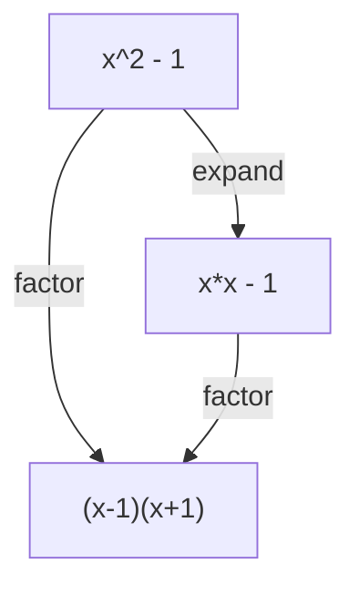

# Tree Search Algorithms

XTK provides tree search algorithms for exploring expression spaces. These algorithms are useful for theorem proving, finding simplifications, and discovering transformation paths between expressions.

## Expression Spaces

An expression space is the graph of all expressions reachable from an initial expression by applying rewrite rules.



Each node is an expression, and each edge is a rule application.

## Available Algorithms

| Algorithm | Description | Best For |
|-----------|-------------|----------|
| BFS | Breadth-first search | Finding shortest paths |
| DFS | Depth-first search | Deep exploration |
| IDDFS | Iterative deepening DFS | Memory-efficient completeness |
| Best-First | Heuristic-guided search | Goal-directed search |
| A* | Optimal pathfinding | Finding optimal solutions |
| MCTS | Monte Carlo tree search | Large search spaces |

## Basic Usage

### Depth-First Search

```python
from xtk.search.dfs import dfs_search

# Define rules
rules = [
    [['+', ['?', 'x'], 0], [':', 'x']],
    [['*', ['?', 'x'], 1], [':', 'x']],
]

# Define goal test
def goal_test(expr):
    return expr == 'x'

# Search
initial = ['+', ['*', 'x', 1], 0]
solution = dfs_search(initial, rules, goal_test)

if solution:
    print("Path found:")
    for step in solution:
        print(f"  {step}")
```

### Breadth-First Search

```python
from xtk.search.bfs import bfs_search

# BFS guarantees shortest path
solution = bfs_search(initial, rules, goal_test, max_depth=10)
```

### Best-First Search

```python
from xtk.search.best_first import best_first_search

# Heuristic: prefer smaller expressions
def heuristic(expr):
    def size(e):
        if isinstance(e, list):
            return 1 + sum(size(x) for x in e)
        return 1
    return -size(expr)  # Negative because we maximize

solution = best_first_search(initial, rules, goal_test, heuristic)
```

## Search Parameters

### Common Parameters

```python
solution = search(
    initial_expr,      # Starting expression
    rules,             # Rewrite rules to apply
    goal_test,         # Function: expr -> bool
    max_depth=100,     # Maximum search depth
    max_nodes=10000,   # Maximum nodes to explore
)
```

### Heuristic Functions

For informed search (Best-First, A*), provide a heuristic:

```python
def expression_similarity(expr, target):
    """Estimate similarity between expr and target."""
    def flatten(e):
        if isinstance(e, list):
            return [e[0]] + sum([flatten(x) for x in e[1:]], [])
        return [e]

    expr_elems = set(flatten(expr))
    target_elems = set(flatten(target))
    return len(expr_elems & target_elems)

# Use in search
def heuristic(expr):
    return expression_similarity(expr, target_expr)
```

## Algorithm Selection Guide

### Use BFS When

- You need the shortest transformation path
- Search space is relatively small
- All transformations have equal cost

### Use DFS When

- Memory is constrained
- Solutions are likely deep in the tree
- Any solution is acceptable (not necessarily shortest)

### Use Best-First When

- You have a good heuristic
- Search space is large
- Goal-directed search is beneficial

### Use A* When

- You need optimal solutions
- Path costs vary
- Good admissible heuristic available

## Example: Proving Trigonometric Identity

Prove that \\(\sin^2(x) + \cos^2(x) = 1\\):

```python
from xtk.search.dfs import dfs_search

# Trigonometric rules
trig_rules = [
    # Pythagorean identity
    [['+', ['^', ['sin', ['?', 'x']], 2],
           ['^', ['cos', ['?', 'x']], 2]], 1],
]

# Initial expression
initial = ['+', ['^', ['sin', 'x'], 2], ['^', ['cos', 'x'], 2]]

# Goal: reach the constant 1
def goal(expr):
    return expr == 1

solution = dfs_search(initial, trig_rules, goal)

if solution:
    print("Identity proved!")
    for step in solution:
        print(f"  {step}")
```

## Example: Algebraic Factoring

Transform \\(x^2 - 1\\) into \\((x-1)(x+1)\\):

```python
from xtk.search.best_first import best_first_search

factor_rules = [
    # Difference of squares
    [['-', ['^', ['?', 'a'], 2], ['^', ['?', 'b'], 2]],
     ['*', ['+', [':', 'a'], [':', 'b']],
           ['-', [':', 'a'], [':', 'b']]]],
]

initial = ['-', ['^', 'x', 2], 1]
target = ['*', ['+', 'x', 1], ['-', 'x', 1]]

def goal(expr):
    return expr == target

def heuristic(expr):
    # Prefer expressions closer to target structure
    if isinstance(expr, list) and expr[0] == '*':
        return 10  # Bonus for multiplication at top level
    return 0

solution = best_first_search(initial, factor_rules, goal, heuristic)
```

## Search Visualization

Track the search process:

```python
class SearchTracker:
    def __init__(self):
        self.visited = []
        self.path = []

    def on_visit(self, expr, depth):
        self.visited.append((expr, depth))

    def on_solution(self, path):
        self.path = path

tracker = SearchTracker()
solution = dfs_search(initial, rules, goal, tracker=tracker)

print(f"Visited {len(tracker.visited)} nodes")
print(f"Solution path length: {len(tracker.path)}")
```

## Performance Considerations

### Memory Usage

- **BFS**: O(b^d) where b=branching factor, d=depth
- **DFS**: O(d) - much more memory efficient
- **IDDFS**: O(d) memory with BFS completeness

### Time Complexity

- Depends on branching factor and solution depth
- Heuristics can dramatically reduce search time
- Consider using memoization for repeated subexpressions

### Optimization Tips

1. **Prune aggressively**: Remove obviously bad branches
2. **Cache seen expressions**: Avoid revisiting states
3. **Order rules**: Try most promising rules first
4. **Limit depth**: Prevent infinite exploration

## Next Steps

- Learn about [Theorem Proving](theorem-proving.md) applications
- Create [Custom Rules](custom-rules.md) for your domain
- See the [Search API Reference](../api/search.md)
