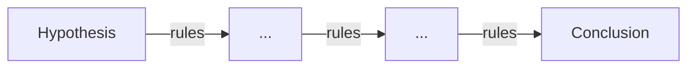

# Theorem Proving

XTK can be used for automated theorem proving by searching for transformation paths between expressions. This guide covers techniques for proving mathematical identities and equivalences.

## Overview

Theorem proving in XTK works by:

1. Starting with an initial expression (hypothesis)
2. Applying rewrite rules to generate new expressions
3. Searching for a path to the target expression (conclusion)



## Basic Theorem Proving

### Proving an Identity

Prove that \\(x + 0 = x\\):

```python
from xtk import rewriter

rules = [
    [['+', ['?', 'x'], 0], [':', 'x']],
]

simplify = rewriter(rules)

# The proof is the simplification itself
hypothesis = ['+', 'x', 0]
result = simplify(hypothesis)

if result == 'x':
    print("Theorem proved: x + 0 = x")
```

### Proving Equivalence

Prove that two expressions are equivalent:

```python
def prove_equivalent(expr1, expr2, rules):
    """Prove expr1 and expr2 are equivalent by simplifying both."""
    simplify = rewriter(rules)

    normal1 = simplify(expr1)
    normal2 = simplify(expr2)

    return normal1 == normal2

# Example: prove (x + 0) * 1 = x
rules = [
    [['+', ['?', 'x'], 0], [':', 'x']],
    [['*', ['?', 'x'], 1], [':', 'x']],
]

result = prove_equivalent(
    ['*', ['+', 'x', 0], 1],
    'x',
    rules
)
print(f"Expressions are equivalent: {result}")  # True
```

## Search-Based Proving

For more complex theorems, use search algorithms:

### Forward Search

Search from hypothesis toward conclusion:

```python
from xtk.search.bfs import bfs_search

def prove_forward(hypothesis, conclusion, rules, max_depth=20):
    """Prove by searching from hypothesis to conclusion."""
    def goal(expr):
        return expr == conclusion

    path = bfs_search(hypothesis, rules, goal, max_depth=max_depth)

    if path:
        print("Proof found:")
        for i, step in enumerate(path):
            print(f"  Step {i}: {step}")
        return True
    return False
```

### Bidirectional Search

Search from both directions for faster convergence:

```python
def prove_bidirectional(hypothesis, conclusion, rules, max_depth=10):
    """Search from both directions, meet in the middle."""
    from collections import deque

    # Forward search from hypothesis
    forward = {str(hypothesis): [hypothesis]}
    forward_queue = deque([hypothesis])

    # Backward search from conclusion (need inverse rules)
    backward = {str(conclusion): [conclusion]}
    backward_queue = deque([conclusion])

    for depth in range(max_depth):
        # Expand forward
        if forward_queue:
            expr = forward_queue.popleft()
            for new_expr in apply_all_rules(expr, rules):
                key = str(new_expr)
                if key not in forward:
                    forward[key] = forward[str(expr)] + [new_expr]
                    forward_queue.append(new_expr)
                    if key in backward:
                        return forward[key] + backward[key][::-1][1:]

    return None
```

## Proving Trigonometric Identities

### Pythagorean Identity

Prove \\(\sin^2(x) + \cos^2(x) = 1\\):

```python
trig_rules = [
    [['+', ['^', ['sin', ['?', 'x']], 2],
           ['^', ['cos', ['?', 'x']], 2]], 1],
]

hypothesis = ['+', ['^', ['sin', 'x'], 2], ['^', ['cos', 'x'], 2]]
conclusion = 1

result = prove_forward(hypothesis, conclusion, trig_rules)
```

### Double Angle Formulas

Prove \\(\sin(2x) = 2\sin(x)\cos(x)\\):

```python
trig_rules = [
    # sin(2x) = 2*sin(x)*cos(x)
    [['sin', ['*', 2, ['?', 'x']]],
     ['*', 2, ['*', ['sin', [':', 'x']], ['cos', [':', 'x']]]]],
]

simplify = rewriter(trig_rules)
result = simplify(['sin', ['*', 2, 'x']])
# Result: ['*', 2, ['*', ['sin', 'x'], ['cos', 'x']]]
```

## Proving Algebraic Identities

### Difference of Squares

Prove \\(x^2 - y^2 = (x+y)(x-y)\\):

```python
algebra_rules = [
    # Difference of squares
    [['-', ['^', ['?', 'a'], 2], ['^', ['?', 'b'], 2]],
     ['*', ['+', [':', 'a'], [':', 'b']],
           ['-', [':', 'a'], [':', 'b']]]],
]

hypothesis = ['-', ['^', 'x', 2], ['^', 'y', 2]]
expected = ['*', ['+', 'x', 'y'], ['-', 'x', 'y']]

simplify = rewriter(algebra_rules)
result = simplify(hypothesis)
print(result == expected)  # True
```

## Calculus Theorems

### Power Rule

Prove \\(\frac{d}{dx}(x^n) = nx^{n-1}\\):

```python
deriv_rules = [
    # Power rule
    [['dd', ['^', ['?v', 'x'], ['?c', 'n']], ['?v', 'x']],
     ['*', [':', 'n'], ['^', [':', 'x'], ['-', [':', 'n'], 1]]]],
]

hypothesis = ['dd', ['^', 'x', 3], 'x']
expected = ['*', 3, ['^', 'x', 2]]

simplify = rewriter(deriv_rules)
result = simplify(hypothesis)
# Result: ['*', 3, ['^', 'x', 2]]
```

## Proof Strategies

### Normalization

Convert both expressions to a canonical form:

```python
def prove_by_normalization(expr1, expr2, normal_rules):
    """Prove equivalence by normalizing both expressions."""
    normalize = rewriter(normal_rules)

    norm1 = normalize(expr1)
    norm2 = normalize(expr2)

    return norm1 == norm2
```

### Case Analysis

Split into cases when needed:

```python
def prove_with_cases(hypothesis, conclusion, rules, cases):
    """Prove by considering multiple cases."""
    for case_name, case_bindings in cases:
        # Substitute case values
        h = substitute(hypothesis, case_bindings)
        c = substitute(conclusion, case_bindings)

        if not prove_forward(h, c, rules):
            print(f"Failed for case: {case_name}")
            return False

    print("Proved for all cases")
    return True
```

### Induction

For proving properties of recursive structures:

```python
def prove_by_induction(property_fn, base_case, inductive_step, rules):
    """Prove property by structural induction."""
    # Prove base case
    if not property_fn(base_case, rules):
        print("Base case failed")
        return False

    # Prove inductive step (assuming property holds for n-1)
    if not inductive_step(rules):
        print("Inductive step failed")
        return False

    print("Proved by induction")
    return True
```

## Generating Proof Objects

Produce human-readable proofs:

```python
class Proof:
    def __init__(self, hypothesis, conclusion):
        self.hypothesis = hypothesis
        self.conclusion = conclusion
        self.steps = []

    def add_step(self, expr, rule_name, justification):
        self.steps.append({
            'expression': expr,
            'rule': rule_name,
            'justification': justification
        })

    def to_string(self):
        lines = [f"Theorem: {self.hypothesis} = {self.conclusion}"]
        lines.append("Proof:")
        for i, step in enumerate(self.steps):
            lines.append(f"  {i+1}. {step['expression']}")
            lines.append(f"     by {step['rule']}: {step['justification']}")
        lines.append("QED")
        return '\n'.join(lines)
```

## Limitations and Considerations

### Undecidability

Some theorem proving problems are undecidable:

- Not all true statements can be proved automatically
- Search may not terminate for invalid theorems
- Use depth limits and timeouts

### Rule Completeness

Ensure your rule set is sufficient:

```python
# Check if rules can prove basic identities
def verify_rule_set(rules):
    tests = [
        (['+', 'x', 0], 'x', "additive identity"),
        (['*', 'x', 1], 'x', "multiplicative identity"),
    ]

    simplify = rewriter(rules)
    for expr, expected, name in tests:
        result = simplify(expr)
        if result != expected:
            print(f"Warning: Cannot prove {name}")
```

## Next Steps

- Explore [Search Algorithms](search-algorithms.md) in depth
- Create [Custom Rules](custom-rules.md) for your domain
- See [Differentiation](../examples/differentiation.md) proofs
