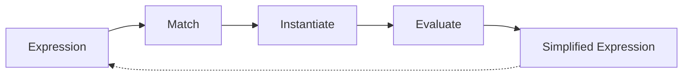
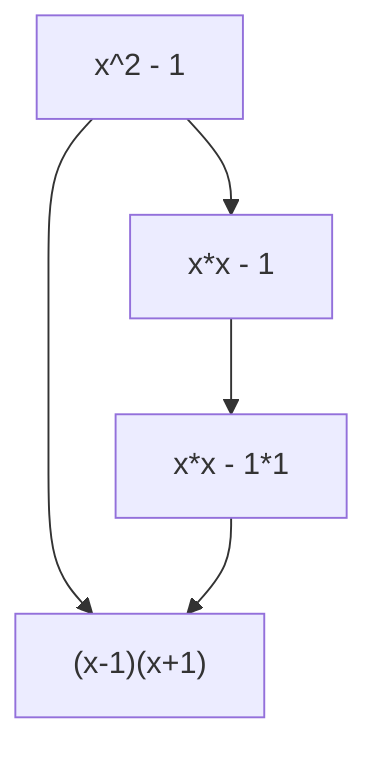

# Core Concepts

Understanding XTK's core concepts is essential for effective use of the toolkit. This guide explains the fundamental ideas behind XTK's design and operation.

## The Big Picture

XTK is built around three fundamental operations:



1. **Match**: Find patterns in expressions
2. **Instantiate**: Create new expressions from patterns
3. **Evaluate**: Compute values and simplify

## Abstract Syntax Trees (AST)

XTK represents all expressions as Abstract Syntax Trees using nested Python lists.

### Why ASTs?

ASTs provide a uniform representation for:

- Mathematical expressions
- Function applications
- Operations
- Variables and constants

### AST Structure

Each AST node is either:

- **Atomic**: A constant or variable (e.g., `42`, `'x'`)
- **Compound**: A list with an operator and operands (e.g., `['+', 2, 3]`)

### Examples

| Expression | AST Representation | Python Equivalent |
|------------|-------------------|-------------------|
| \\(5\\) | `5` | `5` |
| \\(x\\) | `'x'` | `x` |
| \\(x + 3\\) | `['+', 'x', 3]` | `x + 3` |
| \\(2 \times (x + 1)\\) | `['*', 2, ['+', 'x', 1]]` | `2 * (x + 1)` |
| \\(\sin(x)\\) | `['sin', 'x']` | `sin(x)` |
| \\(f(x, y)\\) | `['f', 'x', 'y']` | `f(x, y)` |

## Pattern Matching

Pattern matching is the process of determining if an expression has a certain structure.

### Pattern Syntax

XTK uses special markers to create flexible patterns:

| Pattern | Matches | Example |
|---------|---------|---------|
| `['?', 'x']` | Any expression | Matches `5`, `'a'`, `['+', 2, 3]` |
| `['?c', 'c']` | Any constant | Matches `5`, `3.14`, `-7` |
| `['?v', 'x']` | Any variable | Matches `'x'`, `'foo'` |
| `42` | Exact value | Matches only `42` |
| `'+'` | Exact symbol | Matches only `'+'` |

### How Matching Works

When matching a pattern against an expression:

1. **Atomic matching**: Constants and variables must match exactly
2. **List matching**: Lists must have the same structure
3. **Pattern variables**: Bind to sub-expressions

Example:

```python
pattern = ['+', ['?', 'x'], ['?', 'y']]
expr = ['+', 2, 3]

# Matching produces bindings:
# {'x': 2, 'y': 3}
```

### Nested Patterns

Patterns can be nested arbitrarily deep:

```python
pattern = ['dd', ['*', ['?', 'f'], ['?', 'g']], ['?v', 'x']]
# Matches differentiation of products: d(f*g)/dx
```

## Rewrite Rules

A rewrite rule transforms expressions from one form to another.

### Rule Structure

Each rule consists of two parts:

```python
[pattern, skeleton]
```

- **Pattern**: What to match
- **Skeleton**: What to replace with

### Example Rules

```python
# Additive identity: x + 0 = x
[['+', ['?', 'x'], 0], [':', 'x']]

# Multiplicative identity: x * 1 = x
[['*', ['?', 'x'], 1], [':', 'x']]

# Derivative of constant: d(c)/dx = 0
[['dd', ['?c', 'c'], ['?v', 'x']], 0]

# Power rule: d(x^n)/dx = n*x^(n-1)
[['dd', ['^', ['?v', 'x'], ['?c', 'n']], ['?v', 'x']],
 ['*', [':', 'n'], ['^', [':', 'x'], ['-', [':', 'n'], 1]]]]
```

### Skeleton Instantiation

The skeleton uses `:` to reference matched variables:

```python
pattern = ['+', ['?', 'x'], ['?', 'y']]
skeleton = ['+', [':', 'y'], [':', 'x']]  # Swap x and y

# Applied to ['+', 2, 3]:
# x matches 2, y matches 3
# Skeleton becomes ['+', 3, 2]
```

## Bindings

Bindings are dictionaries that map variable names to values.

### Pattern Bindings

Created during matching:

```python
pattern = ['*', ['?', 'a'], ['?', 'b']]
expr = ['*', 2, 'x']

bindings = match(pattern, expr, {})
# Result: {'a': 2, 'b': 'x'}
```

### Evaluation Bindings

Used during evaluation:

```python
bindings = {
    '+': lambda x, y: x + y,
    '*': lambda x, y: x * y,
    'x': 5,
    'y': 3
}

expr = ['+', ['*', 'x', 'y'], 1]
result = evaluate(expr, bindings)
# Result: 16  (5*3 + 1)
```

## Simplification

Simplification applies rewrite rules recursively to reduce expressions.

### Bottom-Up Simplification

XTK simplifies from the leaves to the root:

```python
expr = ['+', ['*', 'x', 1], 0]

# Step 1: Simplify ['*', 'x', 1] => 'x'
# Step 2: Simplify ['+', 'x', 0] => 'x'
# Result: 'x'
```

### Fixed Point

Simplification continues until no more rules apply:

```python
expr = ['+', ['+', 'x', 0], ['*', 'y', 1]]

# Apply rules until expression stops changing
# Result: ['+', 'x', 'y']
```

## Evaluation

Evaluation computes concrete values from symbolic expressions.

### Evaluation Process

1. **Lookup variables**: Replace variables with their values
2. **Apply operations**: Call functions with their arguments
3. **Return result**: The final computed value

### Example

```python
from xtk.rewriter import evaluate

expr = ['+', ['*', 2, 'x'], 3]
bindings = {
    '+': lambda a, b: a + b,
    '*': lambda a, b: a * b,
    'x': 5
}

result = evaluate(expr, bindings)
# 2*5 + 3 = 13
```

## Expression Spaces

An expression space is the set of all expressions reachable from an initial expression by applying rules.

### State Space Graph



Each node is an expression, edges are rule applications.

### Search Strategies

Different algorithms explore this space:

- **BFS**: Level by level
- **DFS**: Deep first, then backtrack
- **Best-First**: Use heuristics to guide search
- **A***: Optimal pathfinding

## Turing Completeness

XTK's rule system is Turing-complete, meaning it can express any computable function.

### Implications

1. **Unlimited power**: Can implement any algorithm
2. **Halting problem**: Some rewrites may not terminate
3. **Careful design**: Need to ensure rules terminate

### Example: Computing Factorial

```python
rules = [
    # Base case: fact(0) = 1
    [['fact', 0], 1],

    # Recursive case: fact(n) = n * fact(n-1)
    [['fact', ['?c', 'n']],
     ['*', [':', 'n'], ['fact', ['-', [':', 'n'], 1]]]]
]
```

## Rule Ordering

The order of rules matters!

### First Match Wins

XTK applies the first matching rule:

```python
rules = [
    [['?c', 'x'], 'constant'],  # Too general!
    [['+', ['?', 'x'], 0], [':', 'x']]
]

# This will always match the first rule
expr = ['+', 'a', 0]
# Result: 'constant' (not what we want!)
```

### Best Practice

Place more specific rules before general ones:

```python
rules = [
    [['+', ['?', 'x'], 0], [':', 'x']],      # Specific
    [['*', ['?', 'x'], 1], [':', 'x']],      # Specific
    [['?c', 'x'], ['constant', [':', 'x']]]  # General
]
```

## Type System

While Python is dynamically typed, XTK's patterns provide a form of type checking.

### Pattern Types

- `['?c', 'x']` - Only matches constants
- `['?v', 'x']` - Only matches variables
- `['?', 'x']` - Matches anything

### Example

```python
# This rule only applies to derivatives of constants
[['dd', ['?c', 'c'], ['?v', 'x']], 0]

# Won't match: ['dd', ['+', 'x', 'y'], 'x']
# Because ['+', 'x', 'y'] is not a constant
```

## Compositionality

XTK rules compose naturally.

### Building Complex Behavior

Small, simple rules combine to solve complex problems:

```python
# Simple rules
identity_rules = [
    [['+', ['?', 'x'], 0], [':', 'x']],
    [['*', ['?', 'x'], 1], [':', 'x']],
]

derivative_rules = [
    [['dd', ['?c', 'c'], ['?v', 'x']], 0],
    [['dd', ['?v', 'x'], ['?v', 'x']], 1],
    # ... more rules
]

# Combine them
all_rules = identity_rules + derivative_rules
```

### Emergent Behavior

Complex simplifications emerge from simple rules:

```python
expr = ['dd', ['+', ['*', 'x', 1], 0], 'x']

# Applies multiple rules in sequence:
# 1. Simplify x*1 => x
# 2. Simplify x+0 => x
# 3. Differentiate dd(x, x) => 1
# Result: 1
```

## Declarative Programming

XTK follows a declarative paradigm:

- **Describe what**, not how
- **Rules define transformations**
- **System determines application order**

### Imperative vs Declarative

=== "Imperative"
    ```python
    def simplify_add(expr):
        if expr[0] == '+':
            if expr[2] == 0:
                return expr[1]
        return expr
    ```

=== "Declarative"
    ```python
    rules = [
        [['+', ['?', 'x'], 0], [':', 'x']]
    ]
    ```

The declarative approach is more concise and composable.

## Next Steps

Now that you understand the core concepts:

- Learn about [Expression Representation](expressions.md) in detail
- Master [Pattern Matching](pattern-matching.md)
- Explore [Rewrite Rules](rules.md)
- Try [Tree Search Algorithms](../advanced/search-algorithms.md)
