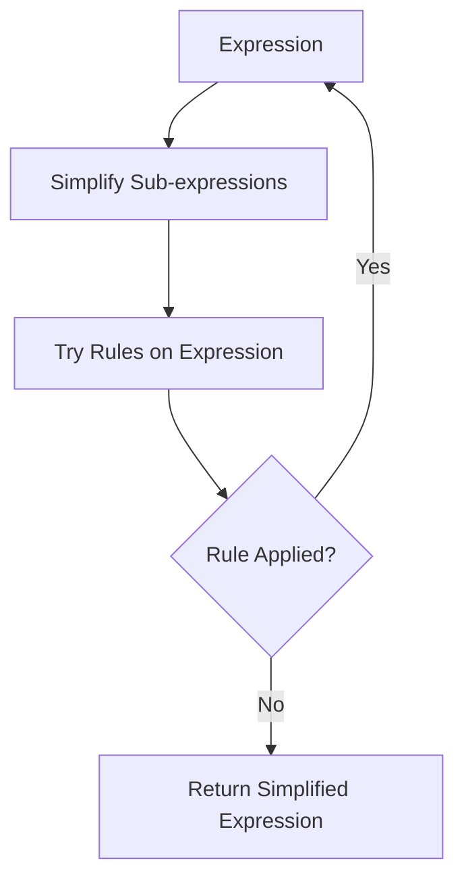

# Simplification

Simplification applies rewrite rules recursively to transform expressions into simpler forms. XTK's simplifier works bottom-up, processing sub-expressions before their parents.

## How Simplification Works



1. **Bottom-up traversal**: Simplify children first
2. **Rule application**: Try rules on the current expression
3. **Fixed-point iteration**: Repeat until no rules apply

## Basic Usage

### Creating a Simplifier

```python
from xtk import rewriter

rules = [
    [['+', ['?', 'x'], 0], [':', 'x']],
    [['*', ['?', 'x'], 1], [':', 'x']],
    [['*', ['?', 'x'], 0], 0],
]

simplify = rewriter(rules)
```

### Simplifying Expressions

```python
# Simple simplification
expr = ['+', 'a', 0]
result = simplify(expr)
print(result)  # 'a'

# Nested simplification
expr = ['*', ['+', 'x', 0], 1]
result = simplify(expr)
print(result)  # 'x'
```

## Simplification Process

### Example: Step-by-Step

Given expression: `['*', ['+', 'x', 0], ['*', 'y', 1]]`

```
Step 1: Simplify sub-expressions
  - ['+', 'x', 0] => 'x' (using x + 0 = x)
  - ['*', 'y', 1] => 'y' (using y * 1 = y)

Step 2: Expression becomes ['*', 'x', 'y']

Step 3: No more rules apply

Result: ['*', 'x', 'y']
```

### Constant Folding

The simplifier automatically evaluates constant arithmetic:

```python
expr = ['+', 2, 3]
result = simplify(expr)
print(result)  # 5

expr = ['*', ['+', 2, 3], 4]
result = simplify(expr)
print(result)  # 20
```

## Using Step Logger

Track each transformation for debugging or display:

```python
from xtk import rewriter
from xtk.step_logger import StepLogger

rules = [
    [['+', ['?', 'x'], 0], [':', 'x']],
]

logger = StepLogger()
simplify = rewriter(rules, step_logger=logger)

expr = ['+', ['+', 'a', 0], 0]
result = simplify(expr)

# View steps
for step in logger.steps:
    print(f"{step['before']} => {step['after']}")
```

## Advanced Features

### Disabling Constant Folding

```python
# Create simplifier without constant folding
simplify = rewriter(rules, constant_folding=False)

expr = ['+', 2, 3]
result = simplify(expr)
print(result)  # ['+', 2, 3] (unchanged)
```

### Combining Rule Sets

```python
from xtk.rule_loader import load_rules

deriv_rules = load_rules('src/xtk/rules/deriv_rules.py')
algebra_rules = load_rules('src/xtk/rules/algebra_rules.py')

# Combine for comprehensive simplification
all_rules = deriv_rules + algebra_rules
simplify = rewriter(all_rules)
```

## Simplification Strategies

### Order-Sensitive Application

Rules are tried in order. Structure your rules for best results:

```python
rules = [
    # First: eliminate zeros and ones
    [['+', ['?', 'x'], 0], [':', 'x']],
    [['*', ['?', 'x'], 1], [':', 'x']],
    [['*', ['?', 'x'], 0], 0],

    # Then: algebraic identities
    [['+', ['?', 'x'], ['?', 'x']], ['*', 2, [':', 'x']]],
]
```

### Normalization

Convert expressions to a canonical form:

```python
normalization_rules = [
    # Move constants to the right
    [['+', ['?c', 'c'], ['?v', 'x']], ['+', [':', 'x'], [':', 'c']]],
    [['*', ['?c', 'c'], ['?v', 'x']], ['*', [':', 'x'], [':', 'c']]],
]
```

## Common Patterns

### Polynomial Simplification

```python
from xtk.rule_loader import load_rules
from xtk import rewriter

rules = load_rules('src/xtk/rules/algebra_rules.py')
simplify = rewriter(rules)

# Simplify polynomial
expr = ['+', ['*', 'x', 1], ['+', 0, ['*', 0, 'y']]]
result = simplify(expr)
print(result)  # 'x'
```

### Expression with Derivatives

```python
from xtk.rule_loader import load_rules
from xtk import rewriter

rules = load_rules('src/xtk/rules/deriv_rules.py')
simplify = rewriter(rules)

# Differentiate and simplify
expr = ['dd', ['+', ['*', 2, 'x'], 3], 'x']
result = simplify(expr)
print(result)  # 2
```

## Debugging Tips

1. **Check rule order**: More specific rules should come first
2. **Use step logger**: See which rules are applying
3. **Test incrementally**: Add rules one at a time
4. **Watch for infinite loops**: Ensure rules don't create cycles

### Detecting Non-Termination

```python
# The rewriter has built-in protection
# Max 1000 iterations before stopping
simplify = rewriter(rules)

# If simplification seems stuck, check your rules
```

## Next Steps

- Master [Evaluation](evaluation.md) for computing values
- Learn about [Custom Rules](../advanced/custom-rules.md)
- Explore [Algebraic Simplification](../examples/algebra.md) examples
